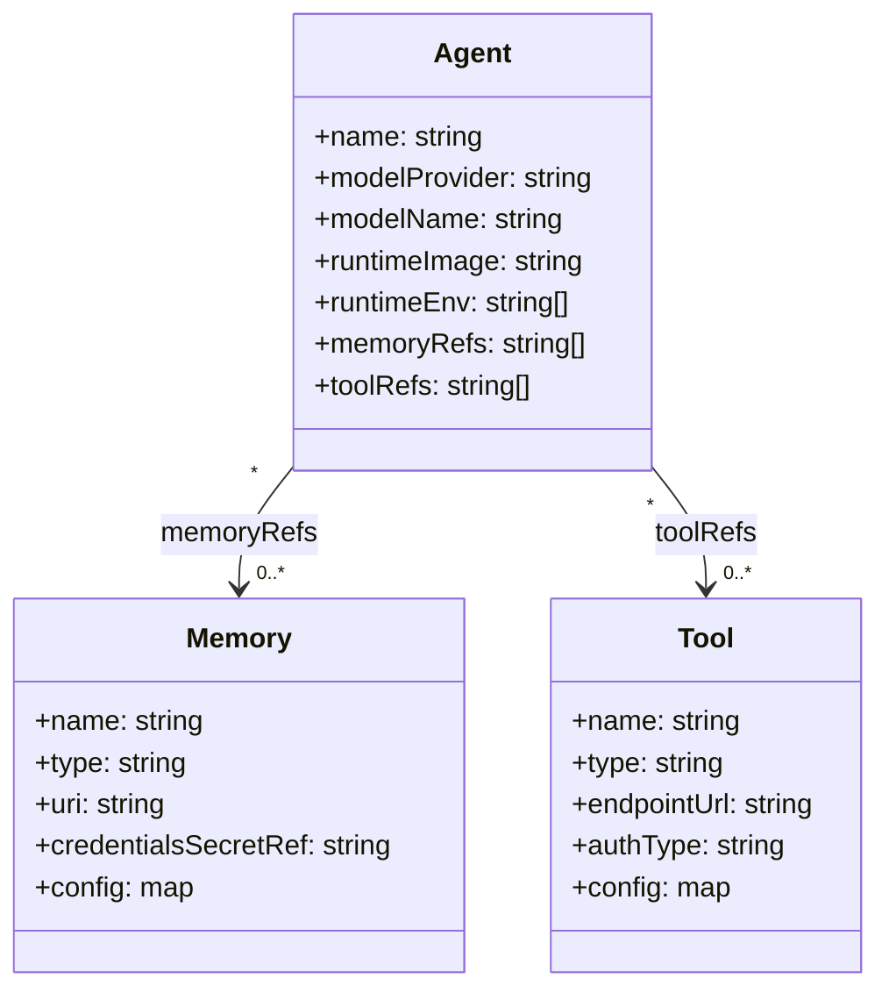

# Designing Proompteng CRDs

The Proompteng platform models agents, memories, tools, and routing policy as Kubernetes Custom Resources. Design priorities:

- **Predictable lifecycle**: Operators reconcile resources to Kubernetes-native workloads.
- **Extensibility**: Each CRD reserves room in `.spec` for future expansion.
- **Status surfaces**: Every resource exposes `.status.phase` to capture reconciliation progress.

## Key Resources

- **Agent** – Declarative specification of a runtime image, model, and optional tool or memory references. The operator renders a `Deployment` + `Service` per resource.
- **Memory** – Points to persistence backends (MongoDB, Postgres, etc.). The operator currently validates configuration and sets a ready status stub.
- **ModelRoute** – Cluster-scoped routing plan with weighted backends. Future versions will include traffic policies and circuit breakers.
- **AgentService** – Defines how an agent is exposed along with authentication and rate limits.
- **EvalSuite** – Schedules scripted evaluations for agents.

## Compatibility Targets

- Schemas target Kubernetes v1.28+.
- Structural schemas leverage `openAPIV3Schema` to ensure kubectl validation.
- Increment versions via the Helm chart (CRD upgrades flow in `docs/upgrade-crds.md`).

## Future Enhancements

- Implement status conditions for richer operator feedback.
- Enforce stricter schema validation for nested fields when feature sets stabilize.
- Add conversion webhooks when graduating past `v1alpha1`.

## Vendor-Agnostic Modeling

Each CRD is intentionally vendor neutral so platform operators can plug in any AI runtime, database, or external service without schema rewrites. The tables below map the schema to the extensibility goals.

### Agent (namespaced)

| Field | Purpose | Why it is vendor agnostic |
|-------|---------|---------------------------|
| `spec.model.provider` / `spec.model.name` | Identifiers for upstream models | Free-form strings; controllers decide how to translate to OpenAI, Anthropic, local weights, etc. |
| `spec.model.parameters` | Arbitrary key/value overrides | Accepts any map so providers can supply bespoke tuning knobs. |
| `spec.runtime.image` | Container image for the agent runtime | Teams package LangChain, LlamaIndex, in-house frameworks, or future agent tech; no restriction on base image or entrypoint. |
| `spec.runtime.env[]` | Environment variables | Allows passing framework-specific configuration without schema changes. |
| `spec.runtime.service` | Optional port/path hints | Generic HTTP metadata; compatible with any serving stack. |
| `spec.memoryRefs[]` / `spec.toolRefs[]` | References to other CRDs | Links to Memories or Tools regardless of vendor implementation. |

### Memory (namespaced)

| Field | Purpose | Why it is vendor agnostic |
|-------|---------|---------------------------|
| `spec.type` | Logical backend type identifier | Not bound to a fixed enum; administrators can register `mongodb`, `postgres`, `pgvector`, `milvus`, or any custom value. |
| `spec.uri` | Connection string or endpoint | Accepts any URI, letting users bring managed cloud services or self-hosted databases. |
| `spec.credentialsSecretRef` | Reference to Kubernetes Secret | Supports any credentials format (API keys, DSNs, certificates). |
| `spec.config` | Additional backend configuration | Free-form map for schema-specific tuning (indices, embedding dims, TTL, etc.). |

### Tool (namespaced)

| Field | Purpose | Why it is vendor agnostic |
|-------|---------|---------------------------|
| `spec.type` | Tool modality (`http`, `grpc`, `sidecar`, etc.) | Open string, enabling future transport types and custom adapters. |
| `spec.endpoint` | Connectivity details (`url`, `timeoutSeconds`, `method`) | Works for REST endpoints, internal services, or proxy gateways; controllers decide how to invoke. |
| `spec.auth` | Authentication metadata | Abstract notion of auth (`none`, `apiKey`, `bearer`) with `secretRef` for credentials; extensible without schema changes. |
| `spec.config` | Implementation-specific options | Configurable dictionary for headers, payload templates, or rate limits across vendors. |

The diagram shows that Agents simply reference Memories and Tools by name; the CRDs themselves do not prescribe vendor-specific fields. Operators translate those declarations into concrete deployments (for example, provisioning a PostgreSQL-backed memory or wiring an API-based tool) while the Kubernetes API surface remains stable.
